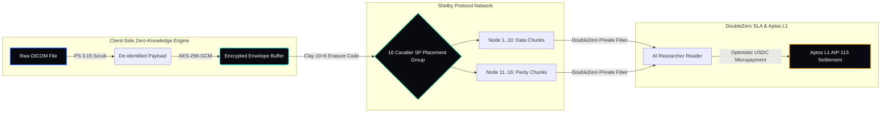

# NuvaMed 🏥

**Decentralized DICOM Imaging Network & Zero-Knowledge Health Data Exchange**

*Engineered for Shelby Protocol (Clay 10+6 Erasure Coding) & Aptos L1 (AIP-113 Account Derivation)*

[](LICENSE)
[](https://shelby.xyz)
[](https://aptoslabs.com)
[](https://nextjs.org)

---

## 1. System Philosophy & Value Drivers

Healthcare networks currently pay **$0.023/GB/month** on centralized cloud providers (AWS S3) plus **$0.09/GB egress bandwidth fees** to share medical imaging datasets (MRI/CT scans). Furthermore, centralized PACS servers store plaintext Patient Health Information (PHI), creating vulnerability vectors for ransomware attacks.

**NuvaMed** introduces a decentralized, zero-knowledge DICOM routing and monetization architecture:

```
┌──────────────────────────────┐        ┌──────────────────────────────┐
│     CENTRALIZED WEB2 PACS    │        │      NUVAMED NETWORK (L1)    │
├──────────────────────────────┤  VS    ├──────────────────────────────┤
│ • $0.023/GB + $0.09 Egress   │        │ • $0.005/GB/mo (-58% cost)   │
│ • Centralized PHI Leak Risk  │        │ • Client-Side ZK PHI Scrub   │
│ • Slow Inter-Hospital Link   │        │ • Sub-1.4ms DoubleZero SLA   │
│ • Subscriptions Bottleneck   │        │ • Per-MB Off-Chain USDC Stream│
└──────────────────────────────┘        └──────────────────────────────┘
```

---

## 2. Platform Topology & Data Flow

NuvaMed separates data encryption, erasure coding, placement group storage, and monetary settlement into distinct, decoupled execution tiers:



### System Design Rationale & Tradeoffs

| Architecture Choice | Tradeoff / Rationale | Alternative Evaluated |
| :--- | :--- | :--- |
| **Client-Side ZK Scrubbing** | **Zero server trust needed.** PHI tags never reach the network. Slight increase in client browser CPU usage during file upload. | Server-side proxy scrubbing (Rejected due to HIPAA leak risk). |
| **10+6 Clay Erasure Coding** | **99.999999999% durability** across 16 nodes with 4x less repair bandwidth during node churn than standard Reed-Solomon. | Standard 3x replication (Rejected due to 300% storage overhead). |
| **DoubleZero Private Fiber** | **Sub-1.4ms tail latency SLA** for streaming 500MB MRI volumes byte-by-byte to AI models. | Public IPFS gateways (Rejected due to high latency spikes). |
| **AIP-113 Account Derivation** | **Gasless Web3 onboarding.** Doctors sign with EVM/Solana wallets to control Aptos namespaces without buying APT gas tokens. | Direct Aptos native keys (Rejected due to user onboarding friction). |

---

## 3. Core Functional Surface

NuvaMed equips medical institutions and researchers with four dedicated operational modules:

### 🛡️ 01. Zero-Knowledge DICOM Router
Executes client-side scrubbing of Patient Name `(0010,0010)`, Date of Birth `(0010,0030)`, Medical Record Number `(0010,0020)`, and Institution `(0008,0080)` before Web Crypto AES-256-GCM envelope encryption.

### ⚡ 02. AI Medical Micropayments Engine
Enables medical AI labs to open optimistic off-chain read channels. Datasets stream byte-by-byte over DoubleZero fiber with per-MB USDC billing ($0.005/MB). Settlements batch to Aptos L1 periodically without blocking streaming.

### 🌉 03. Cross-Chain Identity Bridge (AIP-113)
Maps Ethereum (RainbowKit/MetaMask) and Solana (Phantom) signatures to derived Aptos Account Abstraction namespaces, delegating gas fees automatically.

### 📡 04. Legacy PACS S3 Gateway Proxy
Provides an S3-compatible REST proxy endpoint (`/api/s3/[...path]`). Existing hospital workstations (GE Healthcare, Siemens Syngo, Horos, OsiriX) dispatch DICOM scans to NuvaMed without modifying underlying hospital software.

---

## 4. Trust & Security Architecture

NuvaMed enforces HIPAA PS 3.15 compliance through cryptographically verifiable isolation:

1. **Scrubbing Validation**: Every DICOM header is parsed via `dicom-parser`. Non-anonymized tags trigger a client worker abort before network socket creation.
2. **Secret Envelope Isolation**: Symmetric keys are stored locally in the user's encrypted store (`src/lib/store/useNuvaMedStore.ts`). Plaintext keys are never transmitted to Shelby storage providers.
3. **Placement Group Isolation**: Data chunks are split across 16 independent Cavalier SP nodes. A compromise of up to 5 nodes leaves data fully encrypted and recoverable.

---

## 5. Local Environment & Bootstrap Engine

### Prerequisites
- **Node.js**: `v18.0.0` or higher
- **Package Manager**: `npm` (v9+)

### Quickstart Setup

```bash
# 1. Clone the repository
git clone https://github.com/suosiisan123/NuvaMedV2.git
cd NuvaMedV2

# 2. Install production dependencies
npm install --legacy-peer-deps

# 3. Initialize local environment variables
cp .env.example .env.local

# 4. Launch development server
npm run dev
```

The application will be accessible at [http://localhost:3000](http://localhost:3000).

### Environment Configuration Schema

```env
# Shelby Testnet RPC
NEXT_PUBLIC_SHELBY_NETWORK=testnet
NEXT_PUBLIC_SHELBY_RPC_URL=https://rpc.shelby.xyz
NEXT_PUBLIC_SHELBY_NAMESPACE_ADDRESS=0x1234567890abcdef1234567890abcdef12345678

# Aptos L1 Configuration
NEXT_PUBLIC_APTOS_NODE_URL=https://fullnode.testnet.aptoslabs.com/v1
NEXT_PUBLIC_APTOS_CHAIN_ID=2

# Web3 Connectors
NEXT_PUBLIC_WALLETCONNECT_PROJECT_ID=3a8170812b534d0ff9d794f19a901d64

# DoubleZero Network SLA
NEXT_PUBLIC_DOUBLEZERO_LATENCY_SLA_MS=1.4
```

---

## 6. Verification & Build Diagnostics

Run strict type checks and production bundle builds:

```bash
# Verify TypeScript strict type integrity
npx tsc --noEmit

# Run Next.js code quality audit
npm run lint

# Build optimized production bundle
npm run build
```

---

## 7. Open Source License & Governance

Distributed under the **MIT License**. See [`LICENSE`](LICENSE) for full details. Developed for the Shelby Protocol & Aptos L1 Ecosystem.
